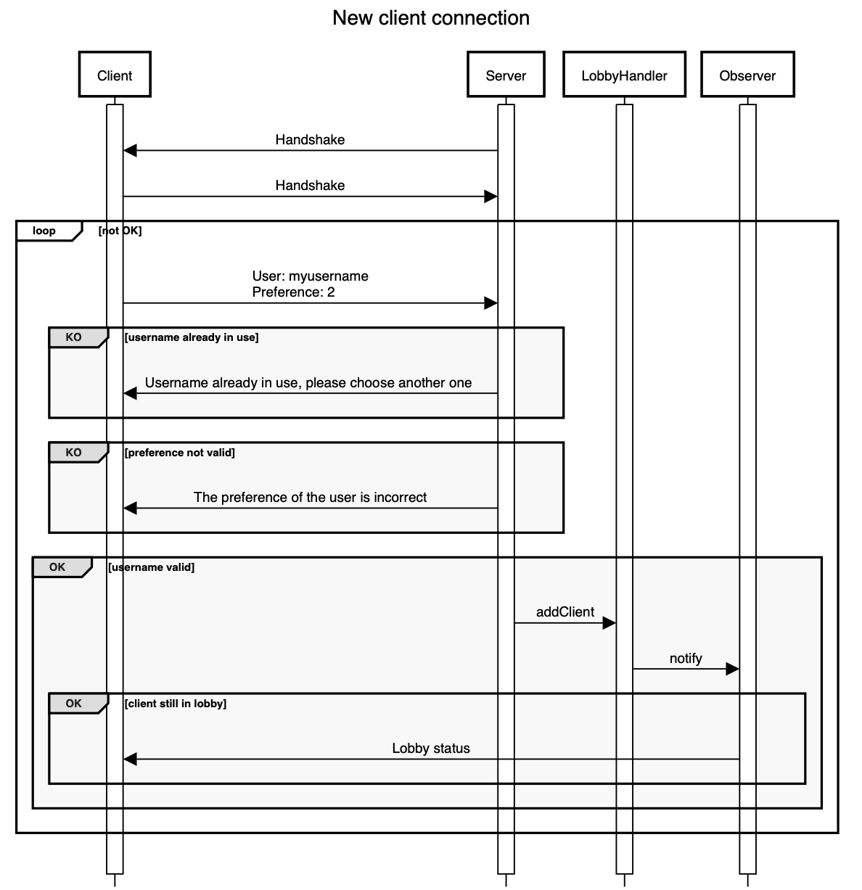
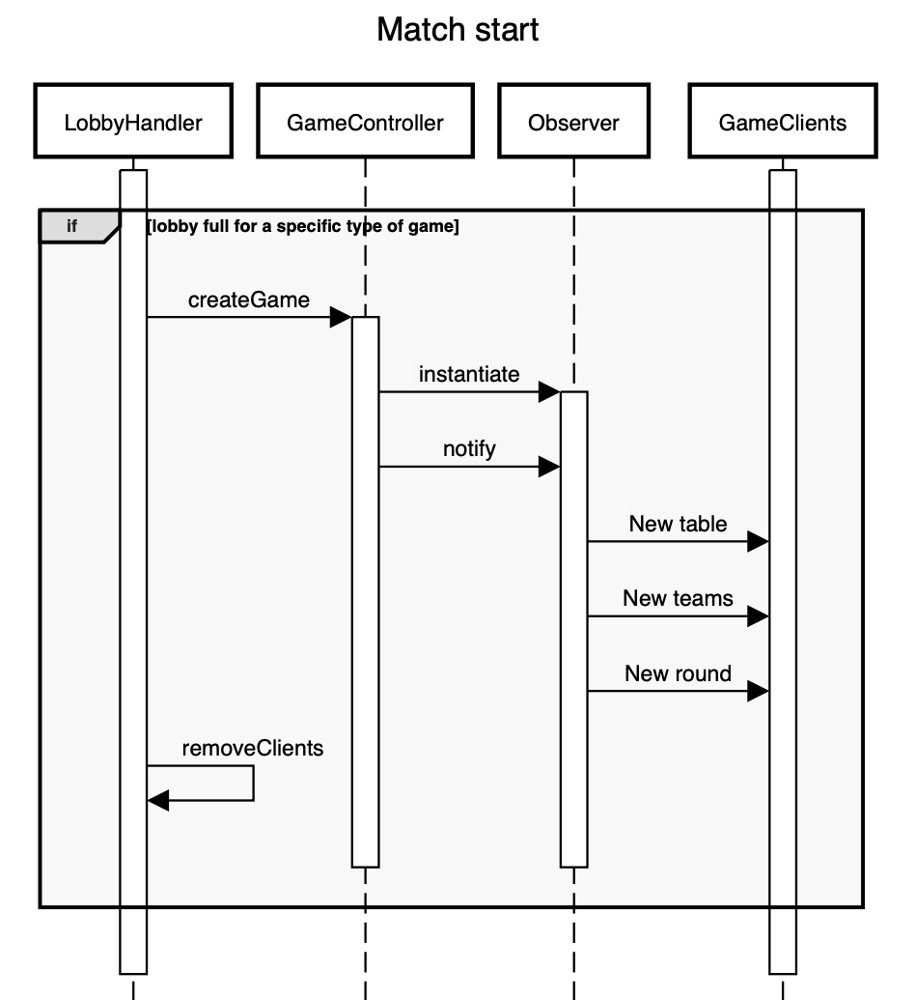
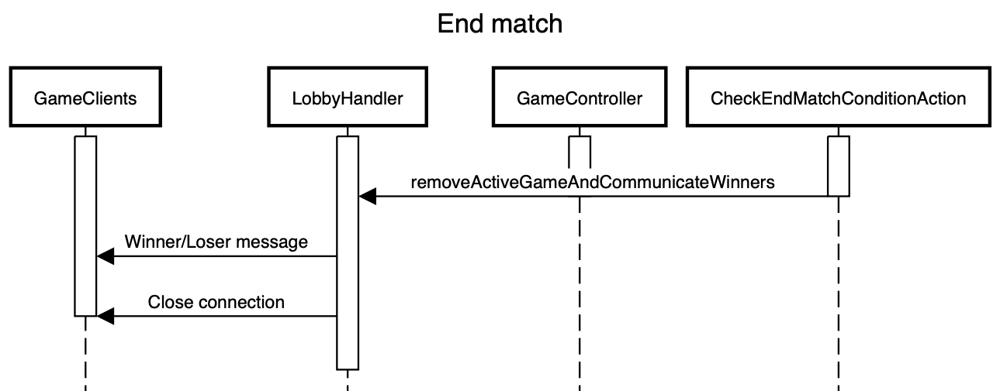
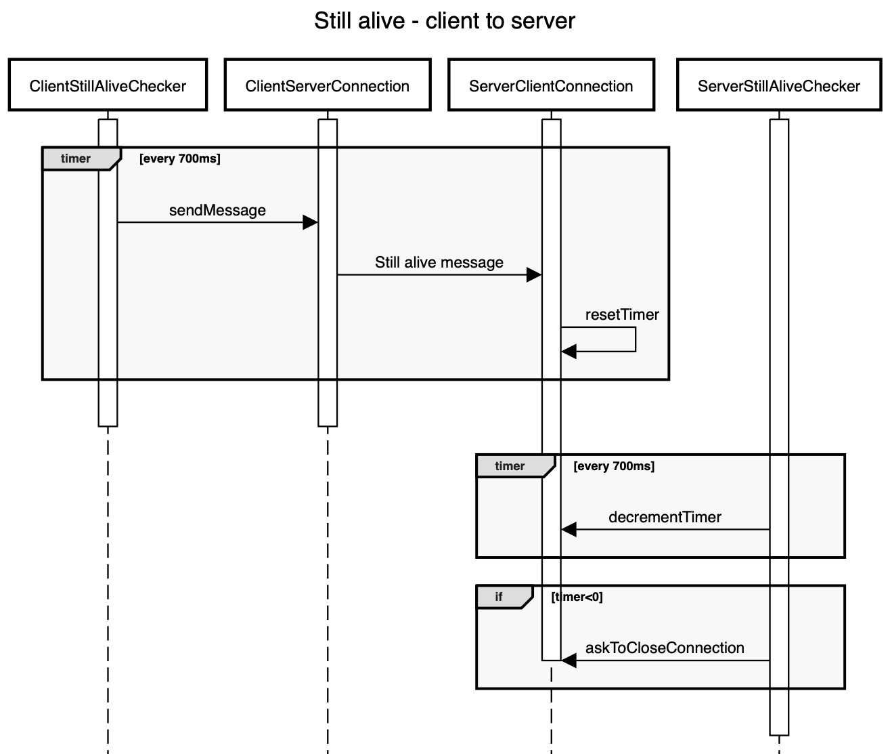

# Communication Protocol

## Overview

The format used for all the messages is JSON, which is language indipendent. The messages have the following fields:
- type, which is a string that describes the type of the message;
- content, which contains the content of the message.

## Connection establishment

The server listens for client connection requests. Once a connection is established through handshaking, the server notifies the client that their request was successful. Then the client sends a USER message to the server. A USER message has the following structure:

```
{
    "type": "USER",
    "payload": {
        "id": "kevin",
        "preference": 2
    }
}
```

The username is a string that identifies the client, while preference is an integer that represents the type of game the client wants to play (two-player game, three-player game or four-player game). The server than adds the user to the waiting list of the lobby. The client can decide to change their preference by sending a USER message with register set to false. In this case the username must be the same used by the client in the registration process. If in the meanwhile a game has been created, the server refuses the request and notifies the client.

## STILL_ALIVE_MSG message

Both the server and the clients periodically send STILL_ALIVE_MSG messages to check if the connection is still alive. If a STILL_ALIVE_MSG message is not received before a specified timeout is reached, the connection is closed. Once the message is received, the timeout is reset.

## LOBBY message

The server sends to all the clients waiting in the lobby the state of the lobby using a LOBBY message. The client can use this information to change their preference and access a game faster. Below is an example of LOBBY message:

```
{
    "type": "LOBBY",
    "payload": {
        "-2": 0,
        "2": 1,
        "-3": 0,
        "3": 0,
        "-4": 0,
        "4": 0
    }
}
```

Negative numbers are for easy games, while positive numbers are for advanced games. 

## ROUND message

When an action finishes executing, it can change the state of the round, which contains the id of the current player and the list of the actions the current player can perform. If a change of state occurs, the server sends the state of the round object to the clients participating in the game. Below is an example of ROUND message:

```
{
    "type": "ROUND",
    "payload": {
        "listOfActions": [
            0
        ],
        "currentPlayer": 2
    }
}
```

## ACTION message

When the current player receives the ROUND message, they decide which action to perform and send an ACTION message back to the server. Below is an example of ACTION message:

```
{
    "type": "ACTION",
    "payload": {
        "actionId": 5,
        "options": {
            "island": "1"
        }
    }
}
```

Options is a map which contains data required by the action.

## TABLE message

The actions modify the state of the game, i.e. the state of the board and of the players. When a change occurs, the server sends the new state to the clients using a TABLE message and a TEAMS message. Below is an example of TABLE message. The fields in payload are self-explanatory.

```
{
    "type": "TABLE",
    "payload": {
        "schoolBoards": [
            {
                "entrance": [
                    123,
                    69,
                    124,
                    117
                ],
                "diningRoom": [
                    [
                        7
                    ],
                    [],
                    [],
                    [],
                    []
                ]
            },
            {
                "entrance": [
                    122,
                    9,
                    114,
                    87,
                    115,
                    71,
                    42
                ],
                "diningRoom": [
                    [],
                    [
                        40
                    ],
                    [],
                    [
                        89
                    ],
                    []
                ]
            }
        ],
        "bag": {
            "students": 100
        },
        "cloudTiles": [
            {
                "id": 1,
                "students": []
            },
            {
                "id": 2,
                "students": [
                    108,
                    36,
                    50
                ]
            }
        ],
        "motherNature": {
            "island": 1
        },
        "islandTiles": [
            [
                {
                    "id": 2,
                    "students": [
                        1,
                        80
                    ],
                    "noEntry": false,
                    "tower": "EMPTY"
                }
            ],
            [
                {
                    "id": 3,
                    "students": [
                        79
                    ],
                    "noEntry": false,
                    "tower": "EMPTY"
                }
            ],
            [
                {
                    "id": 4,
                    "students": [
                        3
                    ],
                    "noEntry": false,
                    "tower": "EMPTY"
                }
            ],
            [
                {
                    "id": 5,
                    "students": [],
                    "noEntry": false,
                    "tower": "EMPTY"
                }
            ],
            [
                {
                    "id": 6,
                    "students": [
                        107
                    ],
                    "noEntry": false,
                    "tower": "EMPTY"
                }
            ],
            [
                {
                    "id": 7,
                    "students": [
                        105
                    ],
                    "noEntry": false,
                    "tower": "EMPTY"
                }
            ],
            [
                {
                    "id": 8,
                    "students": [
                        81
                    ],
                    "noEntry": false,
                    "tower": "EMPTY"
                }
            ],
            [
                {
                    "id": 9,
                    "students": [
                        55
                    ],
                    "noEntry": false,
                    "tower": "EMPTY"
                }
            ],
            [
                {
                    "id": 10,
                    "students": [
                        27
                    ],
                    "noEntry": false,
                    "tower": "EMPTY"
                }
            ],
            [
                {
                    "id": 11,
                    "students": [],
                    "noEntry": false,
                    "tower": "EMPTY"
                }
            ],
            [
                {
                    "id": 12,
                    "students": [
                        53,
                        86
                    ],
                    "noEntry": false,
                    "tower": "BLACK"
                },
                {
                    "id": 1,
                    "students": [
                        29,
                        34
                    ],
                    "noEntry": false,
                    "tower": "BLACK"
                }
            ]
        ],
        "availableProfessorPawns": [
            "GREEN",
            "PINK"
        ],
        "activeCharacterCards": [
            {
                "id": 9,
                "cost": 3,
                "storage": []
            },
            {
                "id": 10,
                "cost": 1,
                "storage": []
            },
            {
                "id": 4,
                "cost": 1,
                "storage": []
            }
        ],
        "availableNoEntryTiles": 4
    }
}
```

## TEAMS message 

Below is an example of TEAMS message, which is the second message sent by the server to communicate the state of the game. The fields in payload are self-explanatory.

```
{
    "type": "TEAMS",
    "payload": [
        {
            "towersColor": "WHITE",
            "numberOfTowers": 8,
            "professorPawns": [
                "YELLOW"
            ],
            "players": [
                {
                    "username": "kevin",
                    "playerId": 1,
                    "coins": 3,
                    "wizard": 2,
                    "assistantCards": [
                        {
                            "id": 11,
                            "cardValue": 1,
                            "movements": 1
                        },
                        {
                            "id": 12,
                            "cardValue": 2,
                            "movements": 1
                        },
                        {
                            "id": 13,
                            "cardValue": 3,
                            "movements": 2
                        },
                        {
                            "id": 14,
                            "cardValue": 4,
                            "movements": 2
                        },
                        {
                            "id": 15,
                            "cardValue": 5,
                            "movements": 3
                        },
                        {
                            "id": 16,
                            "cardValue": 6,
                            "movements": 3
                        },
                        {
                            "id": 17,
                            "cardValue": 7,
                            "movements": 4
                        },
                        {
                            "id": 18,
                            "cardValue": 8,
                            "movements": 4
                        },
                        {
                            "id": 20,
                            "cardValue": 10,
                            "movements": 5
                        }
                    ],
                    "lastPlayedAssistantCard": {
                        "id": 19,
                        "cardValue": 9,
                        "movements": 5
                    }
                }
            ]
        },
        {
            "towersColor": "BLACK",
            "numberOfTowers": 6,
            "professorPawns": [
                "BLUE",
                "RED"
            ],
            "players": [
                {
                    "username": "luka",
                    "playerId": 2,
                    "coins": 3,
                    "wizard": 4,
                    "assistantCards": [
                        {
                            "id": 31,
                            "cardValue": 1,
                            "movements": 1
                        },
                        {
                            "id": 32,
                            "cardValue": 2,
                            "movements": 1
                        },
                        {
                            "id": 33,
                            "cardValue": 3,
                            "movements": 2
                        },
                        {
                            "id": 34,
                            "cardValue": 4,
                            "movements": 2
                        },
                        {
                            "id": 35,
                            "cardValue": 5,
                            "movements": 3
                        },
                        {
                            "id": 36,
                            "cardValue": 6,
                            "movements": 3
                        },
                        {
                            "id": 37,
                            "cardValue": 7,
                            "movements": 4
                        },
                        {
                            "id": 39,
                            "cardValue": 9,
                            "movements": 5
                        },
                        {
                            "id": 40,
                            "cardValue": 10,
                            "movements": 5
                        }
                    ],
                    "lastPlayedAssistantCard": {
                        "id": 38,
                        "cardValue": 8,
                        "movements": 4
                    }
                }
            ]
        }
    ]
}
```

## END_GAME message 

Let's assume that the CheckEndMatchConditionAction detects that one of the game ending conditions is met. The server notifies the clients that the game has ended with an END_GAME message. The two possible END_GAME messages are shown below:

```
{
    "type": "END_GAME",
    "payload": "Congratulations, you are the winner!"
}
```
```
{
    "type": "END_GAME",
    "payload": "You are a loser!"
}
```

## Sequence diagram 

The following sequence diagrams show the communication between the server and the client:







